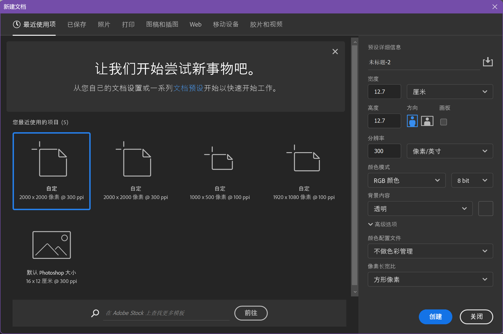
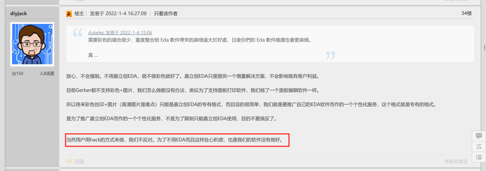

# FuckJLCColorfulSilkscreen
这是一个可以把图片转为嘉立创EDA专属彩色丝印的脚本文件。

## 使用教程
首先我们先安装依赖
```bash
pip install -r requirements.txt
```
这是一个典型的例子：
```bash
python main.py -g gerberPath -o "./out" -ti "./t.png" -bi "./b.png"
```
其中`-g`参数为lceda风格的Gerber文件路径，`-o`为输出文件的路径，`-ti`为顶层图片的路径，`-bi`为底层图片的路径。需要注意的是，如果您使用的不是lceda风格的Gerber文件命名，那您需要使用`-kp`参数指定实际的边框层，例如KiCAD的
```
-ko colorfulTest-Edge_Cuts.gbr
```

### 顶层图片和底层图片的制作
经过测试，立创所使用的SVG解析可能存在一些问题，没有办法很好地支持使用原生的SVG进行制作彩色丝印，但是我们找到了一种曲线救国的路线，使用图片铺满即可。在Photoshop中，我们可以将单位设置为厘米，然后输入实际的PCB尺寸。请注意，如果希望制作出来的丝印不那么糊的话，我们尽可能将DPI设置为300以上。当然，你也可以直接输入像素，只要是保证长宽比不变即可。

* 值得注意的是，底层的丝印为翻转之后的图像，如果您不能理解，可以打开lceda专业版或者KiCAD进行3D预览，查看翻转电路板后的具体图像。

## 注意事项
* 建议采用[FuckJLC](https://github.com/acha666/FuckJLC)对其它EDA软件导出的Gerber文件名处理，实测如果使用KiCAD的默认命名会导致彩色丝印无法被小助手识别，至于是否有效还有待测试。

## 版权
该工程采用`MIT`的开源协议进行共享，不建议进行商用，其中`lceda` `立创EDA` `嘉立创EDA` `嘉立创`等均属于深圳嘉立创科技集团股份有限公司所注册商标，请注意使用。

本工程的逆向行为应该是得到官方的默许，可见贺总在阿莫论坛的发言：

<https://www.amobbs.com/thread-5760459-1-1.html#34>

## 致谢
感谢[小松果](https://github.com/seishinkouk)和索马里的海贼两位大佬对我的帮助，特别是索马里的海贼大佬深入浅出地对我解释了整套原理，让我得到了一次宝贵的学习机会。